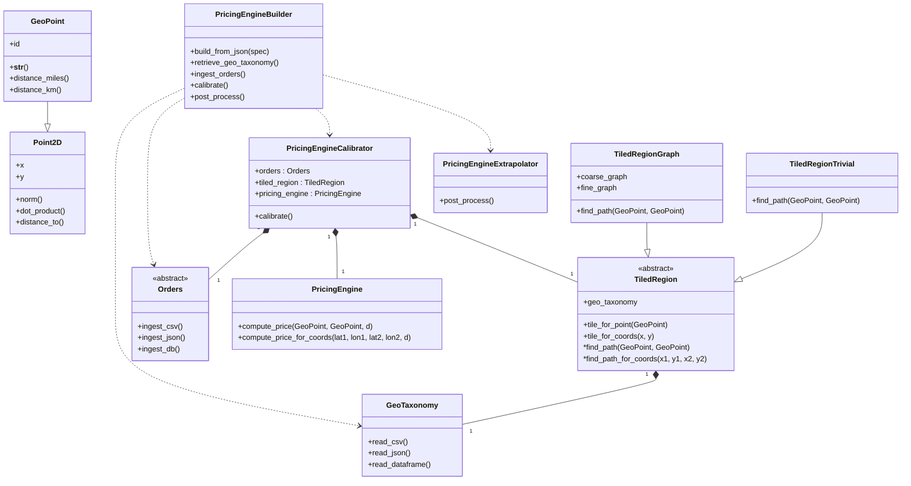

# Architectural design

## Introduction

This document has architectural design elements, discussions, and related diagrams of an Object-Oriented Programming (OOP) framework
that can create, calibrate, and invoke objects that compute numerical values (prices) with Geo-spatial parameters.

----

## Definitions

- [**Well Known Text** (WKT)](https://en.wikipedia.org/wiki/Well-known_text_representation_of_geometry) is markup language for representing vector geometry objects.
  
- **Geo-taxonomy** 
  - A Geo taxonomy is a collection of polygons:
  - The polygons cover a certain Geographical area, like, USA
  - The mesh or grid of a Geo-taxonomy can be regular or irregular
    - For example, square grid, each square with length 1 degree (i.e. ≈ 69 miles or 111 km)
    - Geohash with resolution 4 can be used to define a Geo-taxonomy
  - Geo-taxonomy can be completely specified as a table each row of which specifies a tile
  - The table has the columns:
    - Tile ID 
    - Latitude of tile's center
    - Longitude of tile's center
    - WKT of the polygon that is the tile
- **Design pattern**
  - One of the Gang of Four (GoF) patterns for micro-architectural sofware design.
  - See [Design patterns](https://en.wikipedia.org/wiki/Design_Patterns).
  - The OOP framework specified below is based on Template Method, Strategy, Composite, Decorator, and Builder.
- **Nearest neighbor graph of the Geo-taxonomy**
  - The graph in which every tile is connected to the tiles with which it has a common side.
- **Order**
  - An order has start, end, price, and an optional distance
  - A collection of orders can be specified as a table with the columns:
    - StartLat
    - StartLon
    - EndLat
    - EndLong
    - Distance
    - Price
- **Pricing strategy**
  - A mathematical artifact that for every ordered pair of two Geo-points gives a number (that is a price.)
  - The pricing strategy is static in time:
    - It is only dependent five parameters:
      - Two Geo-spatial points
      - Optionally given distance
  - The pricing strategy function $p$ can be invoked with: 
    - Five numbers as arguments: $p(lat1, lon1, lat2, lon2, d)$
    - Two Geo-points and a number: $p(g_1, g_2, d)$
  - The last, distance argument in both signatures can be skipped
- **Pricing policy**
  - A pricing policy is a collection of pricing strategies that has dependencies on additional parameters, like:
    - Time (hour of the day, or week of the year, etc.)
    - Type of goods, transporters (companies, people), or transporting vehicles
    - Service tier, level, or grade ("smart", "premium", etc.)
- **Pricing engine**
  - A software framework that can be used to create, calibrate, and invoke pricing strategies.

----

## Classes
 
- `Point2D` 
  - Has `(x, y)` coordinates
  - Can compute:
    - norm
    - dot product with
      - other `Point2D` object
      - with `(x2, y2)` pair
    - distance to other point
- `GeoPoint`
  - Inherits from `Point2D`
  - Has an `id`
  - Has a gist (`__str__`) the includes the ID and coordinates
  - Can compute distance in miles and kilometers
    - I.e. convert from Earth radians to miles and kilometers
- `Geo-taxonomy`
  - Can read/import a Geo-taxonomy given in different formats:
    - CSV
    - JSON 
    - JSON (that is pandas data frame)
- `TiledRegion`
  - Abstract class
  - Has a Geo-taxonomy
  - Has methods to find the tile for a given 
    - `GeoPoint`
    - Geo-point given with `(x, y)` coordinates
  - Has abstract methods for finding tile paths between:
    - Two `GeoPoint` objects
    - Two Geo-points given as `(x1, y1, x2, y2)` arguments
- `TiledRegionTrivial`
  - Inherits `TiledRegion` 
  - All tile paths are just the start tile and end tile.
    - For example, for the Geo-points `(x1, y1)` and `(x2, y2)` the tile path is `[self.tile(x1, y1), self.tile(x2, y2)]` 
- `TiledRegionGraph`
  - Use two graphs of tiles in order to find tile paths.
    - The first, coarse graph corresponds to a network of highways or/and primary roads
    - The second, fine graph corresponds to the nearest neighbor graph of the Geo-taxonomy
  - If the coarse graph is not given only the fine graph is used.
- `Orders`
  - Abstract class for the ingestion of collection of orders and transforming them in convenient computational data structures. 
  - The descendants of the class know how to ingest CSV or JSON files, or retrieve orders from databases.
  - Its hierarchy uses both Template Method and Strategy.
- `PricingEngine`
  - Central class of the framework.
  - Each instance of the class is a "pricing strategy".
  - Has methods to compute prices via different signatures.
- `PricingEngineCalibrator`
  - Calibrates a pricing strategy with a set of orders.
  - The class has attributes that are instances of `Orders`, `TiledRegsion`, and `PricingEngine`.
  - Uses Google OR-Tools to formulate and solve the optimizational problem that corresponds to the calibration process.
- `PricingEngineExtrapolator`
  - A class that corresponds to a certain type of post-processing of calibrated pricing strategies.
- `PricingEngineBuilder`
  - Uses JSON dictionary-like specification to create and calibrate a `PricingEngine` object.
  - The building steps include:
    - Retrieval of Geo-taxonomy
    - Ingestion of orders
    - Calibration of a pricing strategy
    - Post-processing
  - The retrieval and ingestion steps can involve reading files or accessing databases. 

----

## Workflows

### Pricing engine creation and calibration

1. Ingest creation and calibration spec
2. Ingest Geo-taxonomy
3. Ingest orders
4. Create a "hollow" `PricingEngine` object
   - With parameters corresponding to the ingested Geo-taxonomy
5. Calibrate
   - Google OR-Tools framework is used here
     - Its linear programming part
   - Formulate the mathematical optimization problem
   - Solve the problem
   - Handle errors or "no solution" events
   - If the solution is successfully found assign values to pricing engine's parameters
6. Post process the calibrated parameter values according to the spec
   - Like, extrapolation of variables

### Using a pricing engine

1. For a given pricing engine identifier find an already created and calibrated `PricingEngine` object.
2. For the given geographical start point and end point find a tile path using the `TiledRegion` object of the `PricingEngine` object.
   - Using the Geg-taxonomy used during calibration. 
3. For the found tile path and optional distance calculate the price.
   - Using the calibrated parameters of the `PricingEngine` object.

----

## CLI

The implementation has a Command Line Interface (CLI) script that allows the creation, calibration, and usage pricing engines
from Unix terminal or similar Windows applications. For example.

```shell
geo_pricing create --pricing-engine-id=myPrEng1 --spec-file=prEng.json
geo_pricing price --pricing-engine-id=myPrEng --start-lat-lon='30.297186,-82.987802' --end-zip-code=45323
geo_pricing recalibrate --pricing-engine-id=myPrEng1 --dateset=ordersNew.csv --add-orders
```

Instead of `--start-lat-lon`, `--start-geo-point`, `--end-zip-code`, etc., the CLI can automatically determine the type of argument. 
It is assumed that calibrates pricing engine objects are quickly rehydrated from their disk storage formats.

----

## Adjustments for a Python implementation

### Signatures

Since Python is hard to use with overloaded signatures, there should be separate method signatures
for methods that would be overloaded in other languages, like, Java. For example:

- `tiledRegionObj.tile_path(g1: GeoPoint, g2: GeoPoint)`
- `tiledRegionObj.tile_path_for_coords(lat1: float, lon1: float, lat2: float, lon2: float)`

Similarly, for price calculation: 

- `pricingEngineObj.price(g1: GeoPoint, g2: GeoPoint, d: float)`
- `pricingEngineObj.price_for_coords(lat1: float, lon1: float, lat2: float, lon2: float, d: float)`


----

## Diagrams

### Class diagram



### Sequence diagram

```mermaid
```