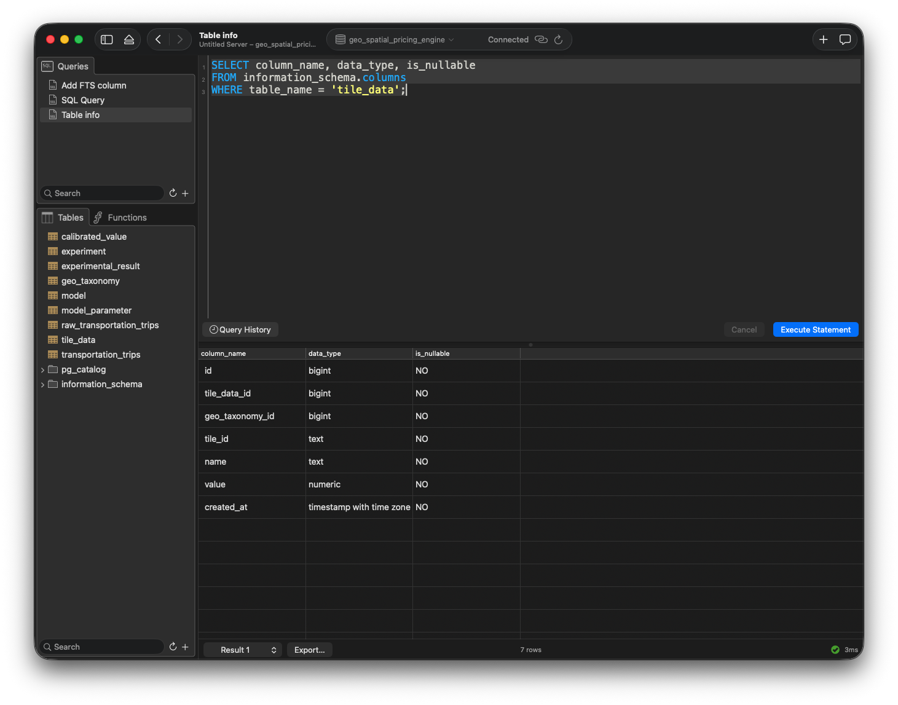

# Model Management System: How to run?

-----

## Installation and setup

Install the following programs on your Operating System (OS).

On macOS install the apps [PostgreSQL](https://www.postgresql.org/download/) and/or [Postico 2](https://eggerapps.at/postico2/).

-----

## PostgreSQL database creation

Using the program Terminal (macOS) create the database "geo_spatial_pricing_engine":


1. Start `psql`

```
psql -U postgres  
```

2. Create the database and connected to it

```
CREATE DATABASE geo_spatial_pricing_engine;
\c geo_spatial_pricing_engine;
```

This message should be given:

> You are now connected to database "geo_spatial_pricing_engine" as user "postgres".

3. Run the creation script

Inside the `psql` app use:

```
\i ./sql/create_mms_tables.sql
```

Alternatively, exit the `psql` app, and run in Terminal:

```
psql -d geo_spatial_pricing_engine -U postgres -f ./sql/create_mms_tables.sql -v ON_ERROR_STOP=1 -e
```

4. Review

Inside the `psql` app run the command:

```
\d
```

This output should be returned:

```
                       List of relations
 Schema |              Name               |   Type   |  Owner  
--------+---------------------------------+----------+---------
 public | calibrated_value                | table    | antonov
 public | calibrated_value_id_seq         | sequence | antonov
 public | experiment                      | table    | antonov
 public | experiment_id_seq               | sequence | antonov
 public | experimental_result             | table    | antonov
 public | experimental_result_id_seq      | sequence | antonov
 public | geo_taxonomy                    | table    | antonov
 public | geo_taxonomy_id_seq             | sequence | antonov
 public | model                           | table    | antonov
 public | model_model_id_seq              | sequence | antonov
 public | model_parameter                 | table    | antonov
 public | model_parameter_id_seq          | sequence | antonov
 public | raw_transportation_trips        | table    | antonov
 public | raw_transportation_trips_id_seq | sequence | antonov
 public | tile_data                       | table    | antonov
 public | tile_data_id_seq                | sequence | antonov
 public | transportation_trips            | table    | antonov
 public | transportation_trips_id_seq     | sequence | antonov
(18 rows)
```

----

## Connecting to the database

### Dedicated app

- Start the app PostgreSQL
- Start Postico 2 and click on the database icon labeled as "geo_spatial_pricing_engine"

Here is an example dashboard of Postico 2 connected to the database "geo_spatial_pricing_engine":



### Python script or notebook

See the notebook ["MMS-database-access.ipynb"](../notebooks/Jupyter/MMS-database-access.ipynb).